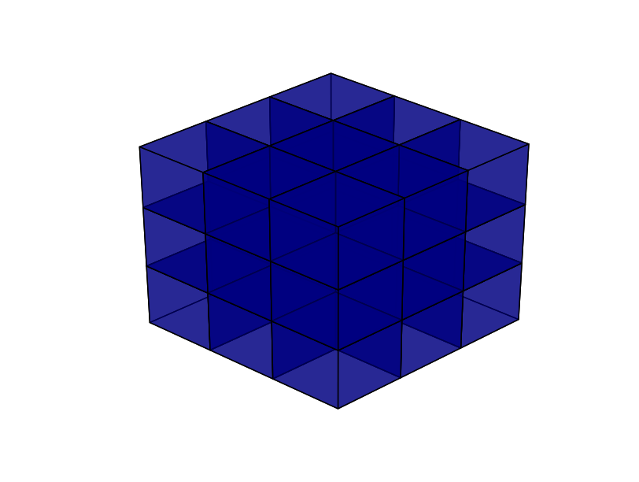
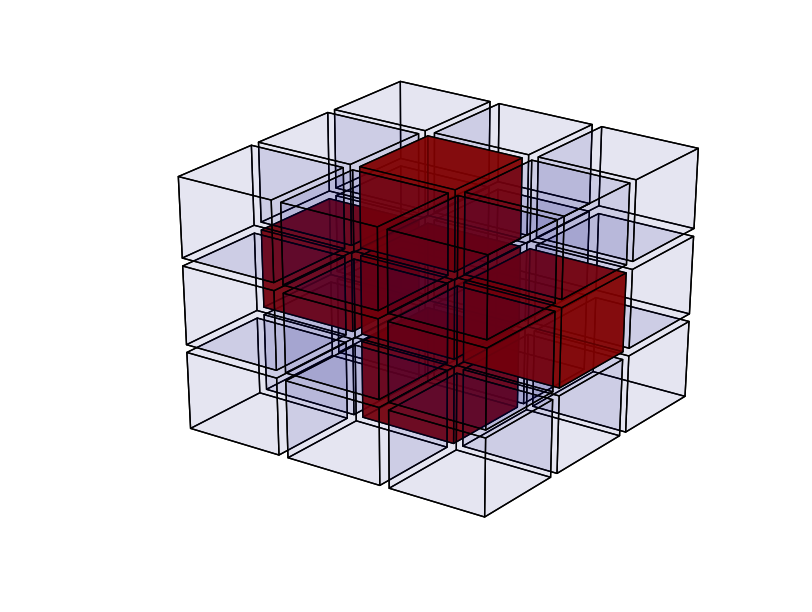
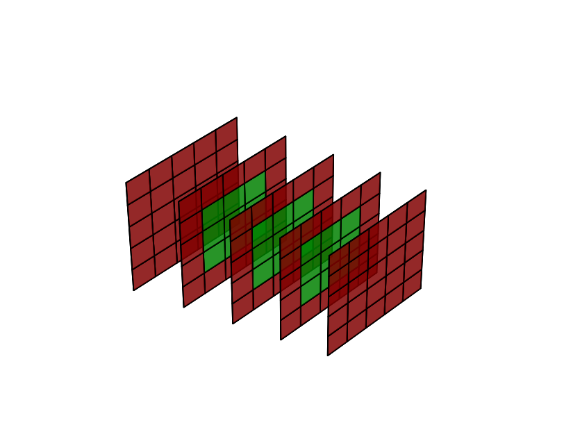
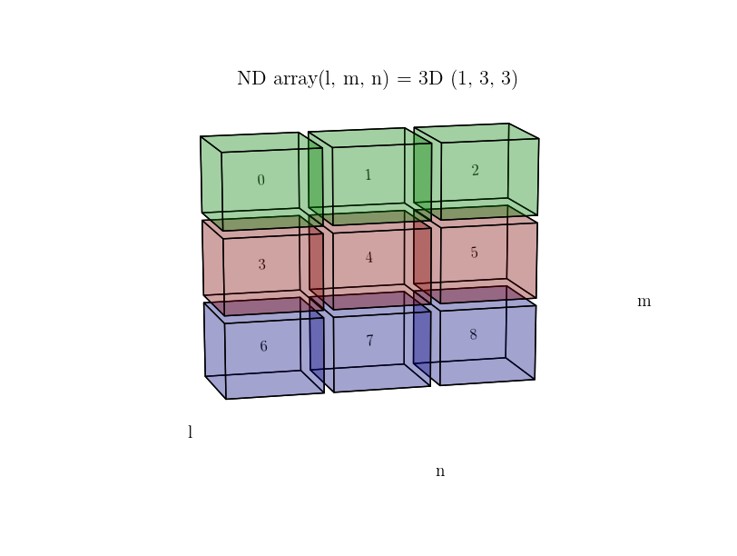

# ndarray_plot
Script for plotting / visualizing three dimensional arrays, see below for a couple of examples.

# Default visualization

# Fivepoint stencil

# Border - Outer / Inner

# Coordinates

# Values

